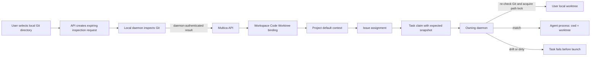

# Workspace Worktree Context Design

## Purpose And Decision

Multica needs a durable way to tell a local agent which checked-out repository
and branch it is allowed to use. An agent role describes what it may do; it
must not be used to infer where it may do it.

Phase 1 introduces workspace-owned **Code Worktrees**. A Code Worktree is a
verified local Git worktree owned by one daemon. A Project can select one as
its default execution context. An issue task inherits the context, and the
daemon refuses to launch if the local checkout has drifted from its verified
branch, commit, repository identity, or clean state.

Phase 1 supports existing local worktrees. It never creates a branch, switches
a branch, or mutates the user's checkout before a task starts.

## Current State

Today a task either runs in an empty isolated directory under
`multica_workspaces/<workspace>/<task>/workdir`, or uses a Project
`local_directory` resource. The latter pins an absolute path to a daemon and
serializes tasks on that path, but has no verified Git identity, branch, commit,
dirty-state check, or visible Project selection.

An agent assigned an unbound code issue receives an empty directory and cannot
safely infer which local checkout it should modify.

## Target Model

### Ownership And Main Chain

The local Git checkout is the source of truth for path, repository identity,
branch, HEAD commit, and dirty state. The server persists a verified binding
for routing and authorization; its cached inspection fields never replace Git.

| Object | Owner | Responsibility |
| --- | --- | --- |
| Code Worktree | Workspace | Records one daemon-local Git checkout and its last verified snapshot. |
| Project | Workspace | Selects one default Code Worktree for code-changing tasks. |
| Issue task | Server and daemon | Carries an immutable expected snapshot and verifies it before launch. |
| Local Git worktree | User machine | Holds source, branch, HEAD, and uncommitted changes. |



The API never probes arbitrary local paths. The owning daemon performs both
registration inspection and task preflight. The task may run in place only
when its runtime belongs to the same daemon as the Code Worktree.

### Code Worktree Record

Add a workspace-scoped `code_worktree` record:

| Field | Meaning |
| --- | --- |
| `id`, `workspace_id`, `daemon_id` | Stable identity and the only daemon allowed to use the path. |
| `local_path`, `canonical_path` | User-selected absolute path and symlink-resolved lock key. |
| `repository_url` | Canonical URL of the selected `origin` remote. |
| `branch`, `head_sha` | Branch and commit from the latest successful inspection. |
| `is_dirty`, `inspected_at` | Worktree state shown to users and copied into preflight. |
| `created_at`, `updated_at`, `created_by` | Audit fields. |

The database stores no foreign keys. Application queries enforce workspace
membership and Project-to-Worktree ownership. Separate single-statement
migrations create `UNIQUE (workspace_id, daemon_id, canonical_path)` and an
index over `project.default_code_worktree_id`, both with concurrent indexes.

A dirty checkout can be registered so users can see it, but is not eligible
for implementation work. This prevents an agent from silently combining its
edits with a user's uncommitted changes. Phase 1 rejects detached HEAD and a
repository without an `origin` remote at inspection time, because its contract
is a user-selected branch of a known repository rather than a generic snapshot.

### Project Binding

Add nullable `project.default_code_worktree_id`. Setting it validates that the
Code Worktree belongs to the same workspace. The Project detail page gains a
**Code context** section showing path, branch, short HEAD, and clean/dirty
state.

Existing `github_repo` and `local_directory` resources stay supported. A
Project cannot choose a Phase 1 Code Worktree while it also has a
`local_directory` resource for the same daemon. The API rejects the ambiguous
configuration and asks the user to remove or explicitly migrate the older
resource.

### Registration, Inspection Proof, And Confirmation

The server must not accept Git facts directly from a desktop or CLI process: a
user token can authorize a request but cannot prove that a daemon inspected the
claimed path. Registration therefore has a short-lived `worktree_inspection`
record. It is bound to the requesting user, workspace, and daemon; it moves
from `pending` to `completed`, `expired`, or one-time `consumed`.

The desktop directory picker registers a Code Worktree as follows:

1. The user selects an online daemon and a directory.
2. The desktop creates a server-side inspection request with that daemon and
   a five-minute expiry, then passes only its opaque ID and the path to the
   localhost daemon endpoint.
3. The daemon validates path safety, read/write access, Git worktree status,
   `origin`, and a non-detached branch. It reads canonical path, current
   branch, HEAD SHA, and porcelain status.
4. Using its daemon credential, the daemon posts the result to the matching
   pending inspection request. The server rejects any daemon, workspace, user,
   or expiry mismatch.
5. The UI reads the completed inspection, displays its facts, and the user
   confirms. The server consumes the inspection atomically and persists exactly
   that stored result.

The same registration and bind flow is available to CLI users:

```bash
multica worktree inspect --local-path /abs/path --daemon-id <daemon-id>
multica worktree add --inspection <completed-inspection-id>
multica worktree list
multica project worktree set <project-id> <worktree-id>
```

`inspect` is read-only and follows the same proof flow. `add` accepts only a
completed inspection ID; it does not accept a caller-provided branch or SHA.
Repository URLs are normalized before duplicate checks.

### Task Dispatch And Preflight

When a user assigns or reassigns an issue to an agent, the server resolves the
agent runtime before inserting a task row. If the Project has a default Code
Worktree, that runtime must belong to the bound daemon. A mismatch is returned
to the caller as a typed validation error; it must not become a queued task
that no daemon can claim.

After this validation, the server copies an immutable execution context into
the `agent_task_queue.worktree_context` JSONB column in the same transaction
that inserts the task. Non-worktree tasks retain the empty-object default. The
task claim response reads this stored context; it must not re-resolve the
Project binding at claim time:

```json
{
  "worktree_id": "...",
  "daemon_id": "...",
  "local_path": "/absolute/path",
  "canonical_path": "/resolved/path",
  "repository_url": "git@github.com:wardlei/multica.git",
  "expected_branch": "feature/example",
  "expected_head_sha": "full-40-character-sha",
  "must_be_clean": true
}
```

Before `execenv.Prepare`, the daemon verifies its ID, the safe canonical path,
repository identity, branch, HEAD, and clean status. It then acquires the
existing canonical-path mutex, sets `LocalWorkDir`, and launches the agent with
that path as `cwd`. The generated task brief records repository, branch, and
SHA so the result is attributable to a concrete checkout.

Preflight must never run `git checkout`, `git reset`, `git clean`, `git pull`,
or any other command that changes the user's checkout. Drift produces a typed
`worktree_preflight_error` before agent launch and asks the user to refresh the
binding or resolve the local checkout.

The snapshot has deliberately different lifecycle rules from the mutable
Project binding:

- A Project bind, unbind, or refresh affects tasks created after that write;
  it never changes a queued or dispatched task's expected checkout.
- An automatic retry copies its parent task's snapshot. A user-triggered rerun
  creates a new task and resolves the Project's then-current binding.
- A Code Worktree cannot be deleted while a non-terminal task snapshot names
  it, even if no Project currently points to it. This makes removal an explicit
  stop-and-drain operation rather than a way to leave live work without an
  auditable binding.
- When the last inspection reports a dirty checkout, assignment to a Project
  bound to it is rejected before task insert. The dirty record remains visible
  so the user can resolve and refresh it.

### API And Clients

Add these workspace APIs:

```text
GET    /api/code-worktrees
POST   /api/code-worktrees
GET    /api/code-worktrees/{id}
PUT    /api/code-worktrees/{id}
DELETE /api/code-worktrees/{id}
POST   /api/code-worktrees/inspections
GET    /api/code-worktrees/inspections/{id}
POST   /api/daemon/code-worktree-inspections/{id}/complete
PUT    /api/projects/{id}/code-worktree
```

`POST /api/code-worktrees/inspections` creates either a registration or refresh
request. It carries `daemon_id`, `local_path`, and optional `worktree_id`; the
server records the current worktree `updated_at` when it creates a refresh
inspection. `POST /api/code-worktrees` creates
a binding from a completed inspection; `PUT /api/code-worktrees/{id}` consumes
a completed refresh inspection. A daemon-only result API accepts results only
for a pending request that names that daemon. The server validates ownership,
field shape, repository URL normalization, and Project compatibility. Project
binding publishes the normal `project:updated` event; the initiating client
invalidates its Code Worktree query after a worktree mutation without mirroring
server state into Zustand.

Desktop supports registration, refresh, bind, and unbind. Web shows bindings
read-only because it cannot inspect arbitrary daemon-local paths. The API
rejects deleting a Code Worktree until no Project or active task snapshot uses
it; a dedicated management surface is a follow-up UI concern.

## Failure, Concurrency, And Observability

| Condition | Required behavior |
| --- | --- |
| Directory is not Git, inaccessible, or protected | Registration returns a typed inspection error. |
| Runtime daemon differs from worktree daemon | Server does not dispatch an in-place task to that runtime. |
| Remote, branch, SHA, path, or clean state drifts | Daemon fails before agent launch and never mutates Git. |
| Another task owns the path | Existing mutex sets `waiting_local_directory` and honours cancellation. |
| Worktree is still bound to a Project | Delete is rejected until it is unbound. |
| Desktop cannot reach the daemon | Registration and refresh fail; existing state remains visible as stale. |

Task logs contain worktree ID, canonical path, expected branch/SHA, observed
branch/SHA, and preflight outcome. The task payload and response expose the
selected context; no mutable global agent setting carries it.

Project bind, unbind, and worktree deletion use one database transaction. Bind
locks the Project and target Code Worktree rows, verifies workspace ownership,
and updates the Project pointer. Delete locks the Code Worktree row and checks
for Project pointers and non-terminal task snapshots in the same transaction
before removing it. A stale inspection can never overwrite a newer binding: refresh
consumes its inspection only when the record's `updated_at` still matches the
value captured when the request began; otherwise it returns a conflict and the
user must inspect again. Task insertion validates the selected worktree before
it writes the immutable snapshot; the daemon remains the final authority and
rechecks the local Git state before launch.

## Phase 1 Boundaries

Phase 1 does not create Git worktrees or branches, switch an existing branch,
support issue-level worktree overrides, grant cloud runtimes local-directory
access, or automate commits/pushes/PRs. Those features need an isolated
worktree lifecycle with explicit branch creation, cleanup, and recovery rules.

## Rollout And Delivery Breakdown

1. **Contracts and storage**: migrations, SQL queries, API schemas, core
   types/query keys, malformed-response tests, inspection-proof lifecycle,
   Project binding validation, and deletion guards.
2. **Daemon inspection and preflight**: read-only Git inspection helpers,
   localhost inspection endpoint, task context, strict preflight, typed
   failures, and task response fields. Reuse the existing path lock.
3. **CLI and desktop Project UI**: inspect/add/list and Project bind commands;
   registration and Code context UI in desktop; read-only web presentation and
   mutation-driven cache invalidation.
4. **Verification and rollout**: test Git parsing, drift detection, path and
   workspace ownership, API authorization, lock/cancellation, and client
   schemas. Exercise clean success, dirty checkout, changed branch, changed
   SHA, daemon mismatch, missing path, and a contended path.

Existing Project resources remain functional. A user may explicitly migrate a
`local_directory` resource after a successful Git inspection; no automatic path
migration is permitted.

## Acceptance Criteria

- A user can register a local Git worktree only through a non-forgeable daemon
  inspection and see repository, branch, SHA, and clean state.
- A Project can select exactly one compatible default Code Worktree.
- An inherited task uses that directory only when its verified Git snapshot
  still matches, and its response/logs expose the context.
- Dirtiness, drift, wrong daemon, invalid path, and concurrent use fail or wait
  predictably without altering the user's checkout.
- An incompatible runtime is rejected before task creation rather than left
  queued for a daemon that cannot run it.
- Existing Project resources remain usable and no user path migrates without
  explicit confirmation.

## Later Decisions

Issue-level overrides and daemon-managed isolated worktrees are a later phase.
They must define branch creation, merge-base selection, push permissions,
cleanup, and recovery of incomplete worktrees; none is implied by Phase 1.
